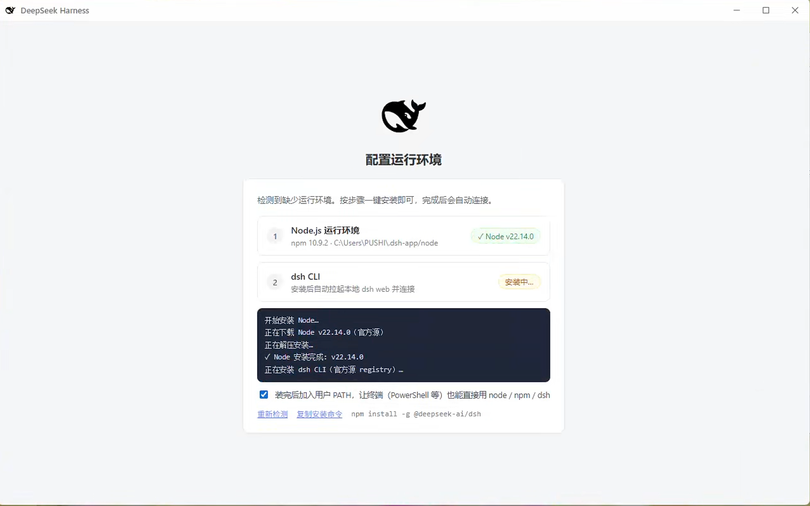
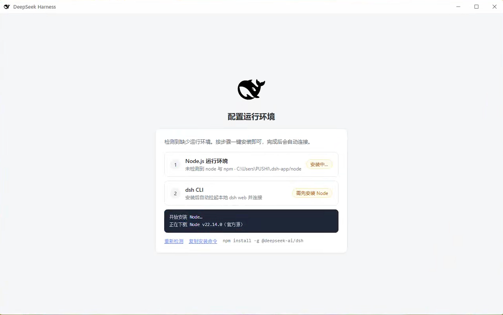
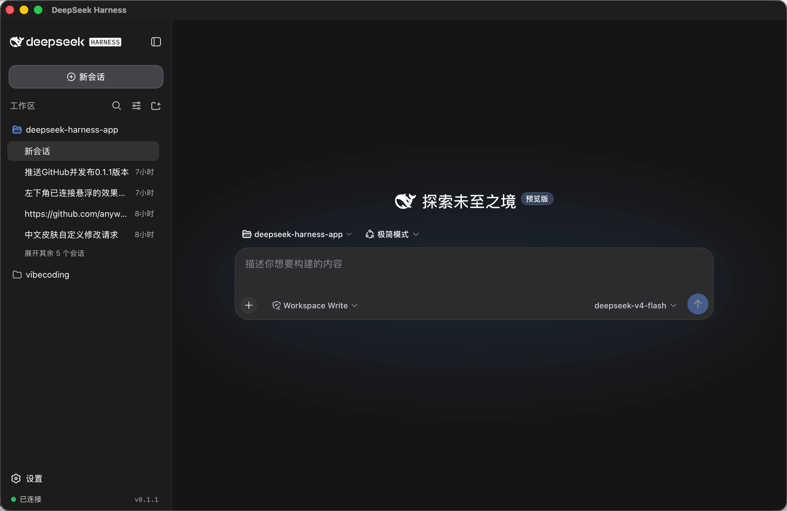
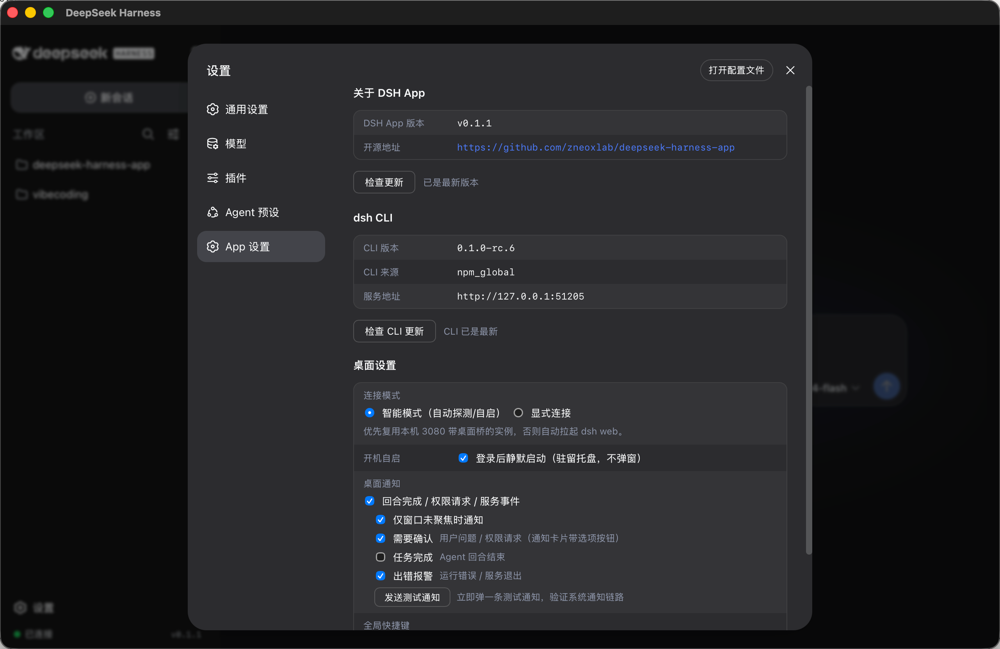
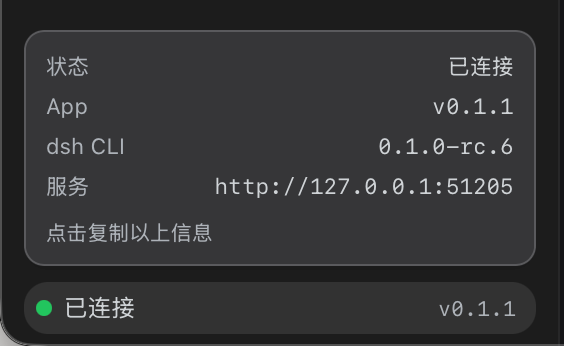

<p align="center">
  
</p>

<h1 align="center">DeepSeek Harness App</h1>

<p align="center"><strong>DeepSeek Harness 跨平台桌面客户端</strong></p>
<p align="center"><em>以官方 dsh Web UI 为底座的原生外壳 —— 融合标题栏、托盘常驻、带更新管理的设置页（简称 <code>dsh-app</code>）</em></p>

<p align="center">
  <a href="./README.md">English</a> ·
  <a href="./README.zh.md">中文</a>
</p>

<p align="center">
  <a href="https://github.com/zneoxlab/deepseek-harness-app"></a>
  <a href="LICENSE"></a>
  
  
  
</p>

---

> [!NOTE]
> **DeepSeek Harness App（dsh-app）不是 DeepSeek 官方产品。** 它把本地的 [DeepSeek Harness](https://github.com/deepseek-ai/deepseek-harness)（`dsh`）CLI 封装成桌面应用：自动检测本机的 Node / npm / dsh 环境，缺少时一键安装/升级；应用启动时自动复用或拉起带插件的 `dsh web`；并给官方 Web UI 补上它应有的桌面体验 —— 融合标题栏、托盘常驻、通知、开机自启、全局快捷键和连接模式。

---

## 为什么不全量重写？

官方 `dsh` 自带**功能完整的 Web UI**（会话、项目、权限、技能、插件、媒体全在里面）。而官方 ACP 服务（`@deepseek-ai/dsh-acp`）是 automation-only：只能创建全新会话，无法加载/列出/恢复/分叉已有会话，撑不起一个完整的桌面指挥台。

所以 **DeepSeek Harness App 选择在官方 Web UI 之上做增强，而不是重造前端**：我们只补浏览器给不了的东西 —— 原生外壳、托盘常驻、桌面集成。

## 和 fork 源码做壳的项目有什么不同？

有些桌面客户端会把 DeepSeek Harness 源码 fork 或 vendoring 进自己的项目，再改造成“核心”。这样包体会更重、容易和上游脱节，而且一旦壳项目不更新，内置核心就可能停在旧版本。dsh-app 走的是相反路线：

|  | fork / 内置源码的壳 | dsh-app |
|---|---|---|
| **核心** | 打包或 fork dsh 代码库，经常还改了内部实现 | 使用官方本地 `@deepseek-ai/dsh` CLI（npm 安装），不 fork、不改写 |
| **更新路径** | 要等壳作者把上游改动合进来 | 直接跟随官方 dsh 的 npm / GitHub Releases 发布，一键检查/升级 |
| **独立性** | 壳停更，内置核心也可能跟着停更 | dsh 核心始终是官方版本，可以脱离本 App 独立升级 |
| **体积/重量** | 常见 Electron + 复制/重复的 Web UI | 轻量 Tauri 原生壳 + 官方 Web UI，dsh 跑在本地安装环境 |
| **网页访问** | 壳可能独占/改动唯一的服务进程，或把 UI 改成另一套 | App 启动/复用标准本地 dsh web，同一个服务在浏览器里照常可访问 |

实际体验重点：

- **自动检测 Node / CLI 环境** —— 启动向导按顺序检测 Node、npm、dsh；dsh 按 `DSH_BIN` → npm 全局 → PATH → 常见安装目录定位，并显示版本和路径。
- **一键安装 / 升级** —— 缺 Node？应用下载官方托管版 Node 到 `~/.dsh-app/node`（免管理员）。缺 dsh？自动用 npm 安装 `@deepseek-ai/dsh`（中文环境自动优先镜像）。App 和 dsh CLI 都可在设置页一键检查/升级。
- **启动/停止自动管理** —— 启动时复用 `127.0.0.1:3080` 上带桌面桥的 `dsh web`，或自启 `dsh --profile dsh-app --port 0`；退出时整树清理子进程。你手动起的普通 `dsh web` 不会被碰，启动 App 也不影响浏览器访问。
- **dsh CLI 版本管理** —— 状态行和 DSH App 设置页显示当前 dsh 版本 / 来源 / 服务地址；对照 npm registry 检测最新版，支持一键更新和复制命令。
- **左下角连接状态** —— 侧栏底部状态行显示彩色圆点 + 已连接/未连接，悬停可看 dsh CLI 版本和服务地址，点击一键复制连接信息。
- **开机自启** —— 可选开机自启（`--hidden` 静默驻留托盘），需要时再唤出桌面窗口。

## 目录

1. [和 fork 源码做壳的项目有什么不同？](#和-fork-源码做壳的项目有什么不同)
2. [功能特性](#功能特性)
3. [截图](#截图)
4. [连接原理](#连接原理)
5. [安装](#安装)
6. [首次运行与排障](#首次运行与排障)
7. [开发与构建](#开发与构建)
8. [测试失败场景](#测试失败场景)
9. [项目结构](#项目结构)
10. [路线图](#路线图)
11. [许可](#许可)

---

## 功能特性

| 领域 | 你会得到 |
|------|----------|
| **智能连接** | 自动检测 dsh CLI（DSH_BIN → npm 全局 → PATH → 常见安装目录）；`127.0.0.1:3080` 上已有**带桌面桥**的实例则复用，否则自启 `dsh --profile dsh-app --port 0` 随机端口（你手动起的普通 `dsh web` 不受影响） |
| **Node / CLI 环境自动检测** | 启动向导按顺序检测 Node、npm、dsh，显示版本/路径；托管 Node 过旧时会提前警告 |
| **dsh CLI 检测** | 缺少 CLI 时显示安装向导 —— 复制安装命令、一键安装/升级、一键重新检测 |
| **一键环境安装** | 缺 Node 或缺 dsh 都能在应用内装好：官方托管 Node 到 `~/.dsh-app/node`，再用 npm 安装 `@deepseek-ai/dsh`（自动选镜像、免管理员） |
| **融合标题栏** | 无边框窗口 + 与系统边框融合的标题栏，按平台使用不同按钮形状：**macOS** 完全使用原生标题栏（真正的系统红绿灯、原生圆角与阴影）；**Windows** 右上角方形按钮（Win11 caption 风格）；**Linux** 左上角圆形按钮（GNOME 风格）。Windows 11 下整窗自动圆角（无边框 + 阴影）。整条标题栏是拖拽区，双击最大化。标题栏颜色全平台跟随**应用内主题**（深色 / 浅色 / 跟随系统） |
| **侧栏左下角状态行** | 侧栏最底部、**设置按钮下面**：左侧状态胶囊（**彩色圆点 + 已连接 / 未连接**），同行靠右显示应用版本号；悬停显示 dsh CLI 版本和服务地址，点击复制连接信息（通过官方 `sidebar.footer.action` 槽注册，设置行上移一格让状态行沉底） |
| **DSH App 设置页** | 注册进官方设置面板的页面：应用信息（版本、开源地址）+ **GitHub Releases 更新管理**；dsh CLI 信息（版本 / 来源 / 服务地址）+ **CLI 版本管理**（对比 npm registry 最新版、一键更新、复制更新命令） |
| **模型预配置** | 融合进**原始模型配置**，不新增独立界面：首次启动时由桥插件服务端把主流渠道（DeepSeek / OpenAI / Anthropic / Google Gemini / OpenRouter / xAI / Moonshot / MiniMax / 智谱 GLM / Mistral / Groq / Together）预写入官方 `llm-pi-ai` 命名空间 —— 它们在「设置 → 模型」中直接就是已配置的渠道，内置模型目录自动启用，只差在那里填 API Key；一旦配过任何渠道就不再执行，删除的渠道不会复活 |
| **系统托盘** | 关窗隐藏到托盘；左键单击唤出窗口；Quit 时整树清理 dsh 进程（不留孤儿） |
| **单实例** | 重复启动只聚焦已有窗口，不再起新服务 |
| **Windows 就绪** | `DSH_PERMISSION_MODE` 未设置时自动回退 `danger-full-access`（Windows 无 confinement 后端） |
| **多语言** | UI 跟随系统语言（简体中文 / English），包括 DSH App 设置页 |
| **原生图标** | 官方 dsh 鲸鱼图标，全平台统一 |

**桌面增强（P1）：** 桌面通知 · 开机自启（`--hidden` 静默驻留托盘）· 全局快捷键（默认 `CmdOrCtrl+Shift+Space` 呼出/隐藏）· 连接模式（智能 / 显式连接远程、容器、自建实例，仅 http/https 且校验可达）—— 设置页位于官方 Web UI 的「桌面设置」（`settings.section` 槽注入）

桌面增强全部通过官方 **DSH 插件机制**（`dsh-app-bridge`，oh-dsh 路线）注入：应用独占一个 `dsh-app` profile 加载桥插件 —— 你自己的 `web` profile 完全不被改动。App 只是原生外壳：不 fork 或内置 dsh 核心、不捆绑 Electron 运行时、不替换官方 Web UI。

---

## 截图

> 来自当前 Windows 开发构建。

| 启动 —— 检测 CLI | dsh CLI 缺失 —— 安装向导 |
|:---:|:---:|
|  |  |

| 首页 —— 外壳内的官方 dsh Web UI |
|:---:|
|  |

| DSH App 设置页 —— 应用与 dsh CLI 更新管理 | 侧栏左下角状态行 —— 连接状态与连接信息 |
|:---:|:---:|
|  |  |

---

## 连接原理

```
应用启动
  │
  ├─ 前端检测 dsh CLI（dsh_detect）
  │     ├─ 找到   → 调用 dsh_connect
  │     └─ 缺失   → 显示安装向导（稳定停留，不会被抢跑）
  │
  ├─ dsh_connect：127.0.0.1:3080 带桌面桥吗？
  │     （GET /dsh-app/status → {"ok":true}）
  │     ├─ 有 → 直接复用（浏览器与桌面共享同一个 dsh 进程）
  │     └─ 无 → 自启 `dsh --profile dsh-app --port 0`
  │              （应用独占 profile，控制台窗口隐藏，随机端口不冲突），
  │              解析就绪行后窗口自动跳转
  │
  └─ 托盘 Quit → taskkill 整树清理
```

连接由**前端检测结果驱动**（而非 Rust 启动时自动连接），所以安装向导永远不会被快速竞态跳过。只有**带桌面桥**的实例才会被复用 —— 你为浏览器开发手动起的普通 `dsh web` 会被忽略，应用另起自己的带插件实例。复用 `127.0.0.1:3080` 时，浏览器和桌面共享同一个 dsh 进程；即使应用自起独立 profile，底层仍是标准本地 dsh web，因此启动 App 不会占用、不会顶掉、也不影响浏览器里的网页访问。

---

## 安装

### 1. 获取应用

从 [Releases](https://github.com/zneoxlab/deepseek-harness-app/releases) 下载对应平台安装包（Windows NSIS、macOS DMG、Linux AppImage/deb —— 随构建发布逐步提供）。

### 2. 安装 dsh CLI

DeepSeek Harness App **不自带** `dsh`，它检测你机器上的安装：

```bash
npm install -g @deepseek-ai/dsh
```

也可以设置 `DSH_BIN` 指向 dsh 可执行文件（例如本地构建的 `lib/bin.js`）。

> 如果 Node 或 `dsh` 缺失，应用内安装向导会帮你装好：下载官方托管版 Node 到 `~/.dsh-app/node`，再自动用 npm 安装/升级 `@deepseek-ai/dsh`，不需要手动开终端。之后也可以在设置页一键检查/升级。

装完直接启动应用，它会自动连接。

---

## 首次运行与排障

**明明装了 dsh，还显示"需要安装 dsh CLI"** —— 应用在启动时探测一次，点击 **"我已安装，重新检测"** 即可重新扫描。

**Windows 权限警告** —— `DSH_PERMISSION_MODE` 未设置时，应用会回退到 `danger-full-access`（Windows 没有 confinement 后端）并打一条警告日志。想用其他模式请显式设置。

**终端里 `dsh` 能用但应用找不到** —— 检查 `npm root -g`；如果全局目录不在 PATH 上，把 `DSH_BIN` 设为 `%APPDATA%\npm\node_modules\@deepseek-ai\dsh\lib\bin.js`（Windows）或对应路径。

---

## 开发与构建

要求：Node 20+、Rust stable、本机已安装 `@deepseek-ai/dsh`（或设置 `DSH_BIN`）。

```sh
npm install
npm run tauri dev        # 开发运行（热更新）
npm run tauri build      # 发布构建（Windows 默认 NSIS）
```

只打 NSIS（跳过 MSI/WiX）：

```sh
npm run tauri build -- --bundles nsis
```

单独重建桥插件 bundle（应用以外部文件形式携带它）：

```sh
cd dsh-app-bridge && npm run build
```

---

## 测试失败场景

设置环境变量 `DSH_APP_MOCK` 可模拟不同启动状态：

| 值 | 效果 |
|---|---|
| （不设置） | 正常流程 |
| `missing-cli` | 模拟未安装 dsh CLI → 安装向导 |
| `no-server` | 模拟 3080 无实例且自启失败 → 连接错误 |

PowerShell：

```powershell
$env:DSH_APP_MOCK = "missing-cli"; .\src-tauri\target\release\dsh-app.exe
```

---

## 项目结构

```
dsh-app/
├─ src/                 # React + TS 前端（浅色 splash / 连接状态）
│  ├─ App.tsx           # 检测驱动的连接流程
│  ├─ WindowControls.tsx # splash 阶段融合标题栏（macOS 原生拖拽带 / Linux 圆形按钮 / Windows 右上角按钮）
│  └─ i18n.ts           # 系统语言 UI（中/英）+ 错误码本地化
├─ dsh-app-bridge/      # 注入官方 Web UI 的 cordis 插件
│  ├─ src/server.ts     #   /dsh-app/status 标记端点（桌面桥探测）
│  │                    #   + 首次启动模型预配置：把主流渠道预写入官方
│  │                    #     llm-pi-ai 模型配置（仅全新配置时，无独立界面）
│  ├─ src/client/index.tsx
│  │                    #   融合标题栏（分平台按钮 + 连接状态）+ 主题同步，
│  │                    #   "DSH App" 设置页（应用更新 + CLI 更新管理）
│  ├─ scripts/build.mjs #   client bundle（factory 包装）+ server bundle
│  └─ cordis.patch.yml  #   bundle 层（loader insert 行）
├─ src-tauri/
│  ├─ src/lib.rs        # Rust 外壳：托盘、单实例、智能连接、整树清理、
│  │                    #   dsh-app profile 引导、窗口控制与 app_info 命令
│  ├─ src/connect.rs    #（P1）连接模式与设置存储
│  ├─ src/notify.rs     #（P1）桌面通知
│  ├─ src/desktop.rs    #（P1）开机自启与全局快捷键
│  ├─ capabilities/     # IPC ACL：应用命令 + 远程 127.0.0.1 访问授权
│  └─ tauri.conf.json   # 窗口 / 打包配置
├─ assets/screenshots/  # 本 README 使用的截图
└─ docs/                # 设计文档与修复记录
```

---

## 路线图

- **P0（已完成）** — 最小可用壳：智能连接、单实例、托盘、整树清理、CLI 检测向导、多语言
- **P2（核心已完成）** — 通过 DSH 插件机制（`dsh-app-bridge`）实现桌面融合：融合标题栏（含连接状态）、"DSH App" 设置页（应用更新管理 + dsh CLI 更新管理）、**模型预配置融合进官方模型配置（首次启动服务端预写主流渠道到 `llm-pi-ai`，无独立界面）**、应用独占 `dsh-app` profile
- **P1（已完成）** — 桌面增强层：桌面通知（`tauri-plugin-notification`）、开机自启（`tauri-plugin-autostart` + `--hidden`）、全局快捷键（`tauri-plugin-global-shortcut`）、连接模式（智能/显式，`connect.rs` 设置存储于 `~/.dsh-app/settings.json`）；设置 UI 注入官方设置页「桌面设置」。设计与合入记录见 `docs/P1-design.md` / `docs/P1-integration-checklist.md`
- **P2（后续）** — 插件路线上的更多工作台：PTY 终端、Git Review、插件市场

---

## 许可

[MIT](LICENSE) © dsh-app contributors
